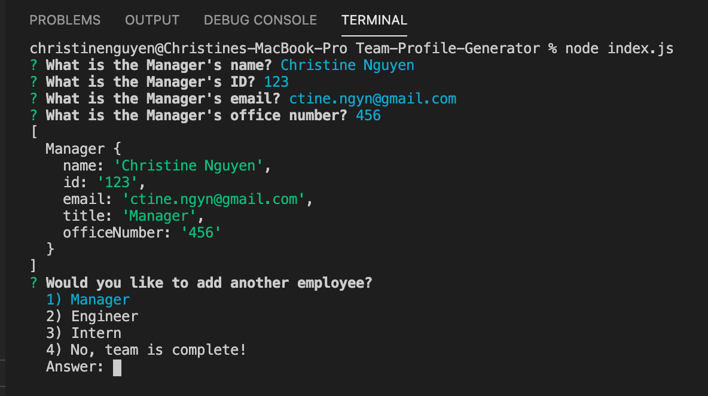
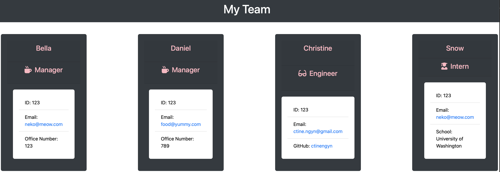

# Team-Profile-Generator

## Description
 A node.js application that uses user input from inquirer to populate a html file for user repository. The html file is created in the dist directory and can be found here: https://drive.google.com/file/d/1nSPD-ilQbneOTodOpG056ecQDh0HMyYQ/view 🎥

## Table of Contents
  * [Usage](#usage)
  * [Test](#test)
  * [License](#license)
  * [Example](#example)
  * [Contact](#contact)

## Usage
Run the following command at the root of your project and answer the prompted questions: `node index.js`
---

## Test
**One of the most important skills to master as a web developer is version control. Building the habit of committing via Git is important for two reasons:**
* Your commit history allows you to revert your code base in the event that you need to return to a previous state.

* Your commit history is a signal to employers that you are actively working on projects and learning new skills.

--- 

## License
This application is covered by the Apache 2.0 License license

---

## Badges

---

## Example
A screenshot showing an example user input is shown below:

When all information on the team member has been entered, the user is asked whether there are any more members they would like to add. If so, the user is asked the same questions about the new team member. If not, an HTML file is created with cards displaying the information on all the team members entered by the user in the outputs folder titled "index.html." A screenshot of an example team profile is shown below:

---

## Contact

**Email:**
ctine.ngyn@gmail.com

**GitHub:**
[Christine's GitHub](https://github.com/ctinengyn)